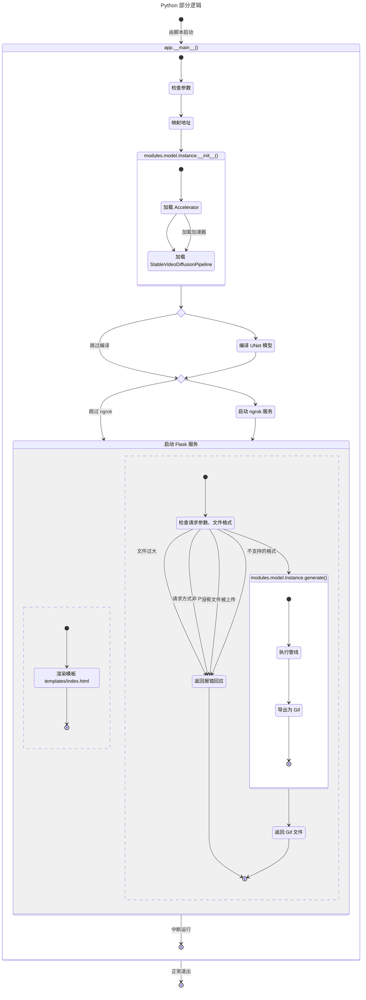
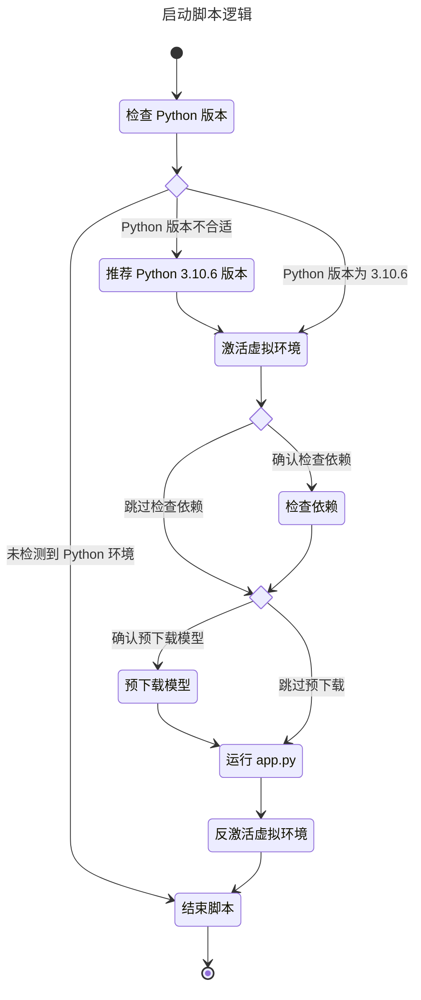

# turn-live-photos
将静态照片通过 AIGC 生成为实况照片

### 目录

- [效果图](#效果图)
- [常见 Q & A](#常见-q-&-a)
- [配置要求](#配置要求)
    - [使用 CPU 或其它版本的 CUDA ](#使用-cpu-或其它版本的-cuda)
    - [使用 AMD 显卡](#使用-amd-显卡)
    - [指令集优先级](#指令集优先级)
- [下载/安装](#下载安装)
    - [下载最新的稳定版](#下载最新的稳定版)
    - [下载最新的实验版](#下载最新的实验版)
- [使用](#使用)
    - [配置](#配置)
    - [API 接口](#api-接口)
- [模型](#模型)
- [协议](#协议)
- [其它平台](#其它平台)
    - [Google Colab](#google-colab)
        - [使用现成笔记本](#使用现成笔记本)
        - [手动新建笔记本](#手动新建笔记本)
    - [Hugging Face Spaces](#hugging-face-spaces)
- [项目结构](#项目结构)
- [编码标准](#编码标准)
- [尾声](#尾声)

### 效果图

<span style="margin-left: 1rem;"></span>

__源文件 -> 输出__

> 注：此处使用配置 `output_fps=7;output_frames=30;model_inference_steps=20;model_decode_chunk_size=8;`、参数 `motion_bucket_id=127,max_guidance_scale=3,noise_aug_strength=0.02`。

<span style="margin-left: 1rem;"></span>

__源文件 -> 输出__

> 注：此处使用配置 `output_fps=15;output_frames=30;model_inference_steps=20;model_decode_chunk_size=8;`、参数 `motion_bucket_id=127,max_guidance_scale=3,noise_aug_strength=0.1`。

<span style="margin-left: 1rem;"></span>

__源文件 -> 输出__

> 注：此处使用配置 `output_fps=15;output_frames=30;model_inference_steps=20;model_decode_chunk_size=8;`、参数 `motion_bucket_id=255,max_guidance_scale=6,noise_aug_strength=0.1`。

### 常见 Q & A

#### __Q:__ 为什么生成的实况几乎没有什么运动感？

__A:__ 请检查**引导指数**_（`max_guidance_scale`）_，越高的值越会与原照片偏离。

#### __Q:__ 为什么生成的实况会感到对象间糊在一起？

__A:__ 此属于**正常现象**，若要追求更好的效果，可以适当提高**推理步数**_（`model_inference_steps`）_。

#### __Q:__ 为什么生成 CUDA 提示 Out of Memory _(OOM)_？

__A:__ 尽可能降低配置的值，如**推理步数***（`model_inference_steps`）*等。如果设备支持显存**动态分区**_（`expandable_segments`）_，请添加参数 `--max-split-size-mb=<size>`_（其中`<size>`应是你的空闲显存大小）_。

#### __Q:__ 为什么生成完毕后没有照片？

__A:__ 我在测试时发现是 `TensorHalf` 的问题 _（即数据类型不匹配 `fp16` 的半精度，但奇怪的是它仍旧能够正常运行）_，目前已经在 [更新例子，修复 TensorHalf 的问题（未经测试） · CoolCLK/turn-live-photos@abf2a2a](https://github.com/CoolCLK/turn-live-photos/commit/abf2a2a2704b6342cd843f13f8e71923477f3b72) **尝试**修复了此问题，

### 配置要求

Python：推荐使用 `3.10.6`，默认使用 `pytorch==2.7.1+cu128`。

> 前往 [requirements.txt](requirements.txt) 可以修改 `pytorch` 的依赖版本，不要忘记修改 [configuration.ini](configuration.ini) 的 `InstalltionOptions.PyTorchIndexUrl` 哦。
> `pytorch` 依赖的可用版本及 `InstalltionOptions.PyTorchIndexUrl`，可以在 [Get Started](https://pytorch.org/get-started/locally/) 查询，截至该文档更新时，目前支持 `2.7.1+cu118`、`2.7.1+cu126`、`2.7.1+cu128`，_更高的版本往往支持更多的特性_。

显卡：至少显存大于 _8G_，默认 [CUDA](https://developer.nvidia.com/cuda-toolkit) 版本为 `12.8`。

> 此项目同时使用了 `accelerate==1.7.0` ，支持多卡运算。

### 下载/安装

#### 下载最新的稳定版

访问 [turn-live-photos](https://github.com/CoolCLK/turn-live-photos) 中的 [Releases](https://github.com/CoolCLK/turn-live-photos/releases)。

找到最新的 [Release](https://api.github.com/repos/CoolCLK/turn-live-photos/releases/latest) 即可下载。

> 目前尚未稳定版提供。

#### 下载最新的实验版

_警告：实验板往往是不稳定、不确定能够正常运行的版本！_

访问 [turn-live-photos](https://github.com/CoolCLK/turn-live-photos)，找到 __Codes__ 并点击 __Download ZIP__ 或[直接下载](https://github.com/CoolCLK/turn-live-photos/archive/refs/heads/main.zip)。

当然，你也可以使用 [Git](https://git-scm.com/) 下载。

打开终端，输入 `git clone https://github.com/CoolCLK/turn-live-photos.git` 后等待即可。

### 使用

假定你已经下载好了 [turn-live-photos](https://github.com/CoolCLK/turn-live-photos)，见表。

|系统|操作|
|---|---|
|Windows|在此文件夹中打开终端，输入 `.\START.bat`，或直接双击打开也可。 |
|MacOS/Linux|打开终端，`cd` 到项目文件夹，输入 `.\START` 即可。|

倘若你想要提前下载模型，不仅要安装 [Git](https://git-scm.com/)，还要安装 [Git LFS](https://git-lfs.com/)。

> 注：由于 [huggingface.co](https://huggingface.co/) 被 GFW 屏蔽，因而配置文件中允许你使用 [hf-mirror.com](https://hf-mirror.com/) 下载模型，但这样只能够以本地模式运行模型，其一般存放在 `models` 文件夹下，意味着你也可以下载它人提供已经下载好了的仓库。

之后，跟随脚本的指引打开部署的网页。

拖放或上传任意一张照片后等待即可。

> 使用 1024 x 576 的图像最佳，其它大小的照片也可。

倘若你不想让结果输出到 `outputs` 的话，可以添加参数 `--output-temp`。

#### 配置

我们使用 [configuration.ini](configuration.ini) 进行配置，不用担心，它们易于配置！

见表：

|项|键|值类型|说明|
|---|---|---|---|
|`LaunchOptions`|`UseVenv`|`boolean`|使用虚拟环境。|
|`LaunchOptions`|`SkipPythonChecking`|`boolean`|跳过 [Python](https://python.org) 的版本检查。|
|`LaunchOptions`|`RunArguments`|`string`|程序的运行参数。|
|`InstalltionOptions`|`PyTorchIndexUrl`|`string`|镜像缺失依赖会在链接中获取，可在 [Get Started](https://pytorch.org/get-started/locally/) 查询。|
|`InstalltionOptions`|`PipMirrorUrl`|`string`|使用 `pip` 指令时选用的镜像源。|
|`InstalltionOptions`|`ModelRepositoryUrl`|`string`| 目标模型的仓库 URL 链接，默认使用 [HF-Mirror](https://hf-mirror.com/) 的 [stabilityai/stable-video-diffusion-img2vid-xt](https://huggingface.co/stabilityai/stable-video-diffusion-img2vid-xt)，**需要与 `ModelOptions` 中的 `ModelName` 相匹配**。|
|`StoreOptions`|`VenvHome`|`string`|[Python](https://python.org) 虚拟环境的位置。|
|`StoreOptions`|`ModelsHome`|`string`|本地/离线模型存放位置。|
|`WebOptions`|`Host`|`string`|主机名。|
|`WebOptions`|`Port`|`int`|取值范围`0`~`65535`，运行端口。|
|`WebOptions`|`MaxContentLength`|`int`|以字节为单位，最大允许上传文件的大小。|
|`StoreOptions`|`OutputsHome`|`string`|输出文件的位置。|
|`ModelOptions`|`OutputFPS`|`int`，以帧/秒作为单位|最好使用`15`或`24`，效果最好。|
|`ModelOptions`|`OutputFrames`|`int`|输出帧数。|
|`StoreOptions`|`ModelsHome`|`string`|储存模型的位置，**需要在末尾加上 `/`**|
|`ModelOptions`|`InferenceSteps`|`int`|越高质量也会越高，但是要求的显存会更高。|
|`ModelOptions`|`DecodeChunkSize`|`int`|越高的数值有利于减少显存，***小概率*会造成画面撕裂**_（据 [Hugging Face](https://huggingface.co) 官方文档所说，但实际影响不大，可以不填写此项）_。|
|`ModelOptions`|`ModelName`|`string`|模型名称，此项目使用 [stabilityai/stable-video-diffusion-img2vid-xt](https://huggingface.co/stabilityai/stable-video-diffusion-img2vid-xt)，若追求性能，可以使用 [stabilityai/stable-video-diffusion-img2vid](https://huggingface.co/stabilityai/stable-video-diffusion-img2vid)，**需要与 `InstalltionOptions` 中的 `ModelRepositoryUrl` 相匹配**。|
|`ModelOptions`|`UNet`|`boolean`|如果可以使用 UNet 模型的话，那就使用，同时会占用一部分显存，*仅限 Linux 平台*|
|`ModelOptions`|`ImagePromptWidth`|`int`|将输入的照片**拉伸**的宽度，调整其数值可以改善输出质量。|
|`ModelOptions`|`ImagePromptWidth`|`int`|将输入的照片**拉伸**的高度，调整其数值可以改善输出质量。|

当然，你也可以在 Web 中调节参数，但这是有限的，__因为设计时是考虑到您与您的访客的__，因而一些造成**崩溃**的数值*不会被允许在 Web 上调节*。

如果像获取更多参数帮助，可以使用命令 `python __main__.py --help` 来查阅。

> 我们将您的图像拉伸为了 1024x576 的图像，目前来看，这是一个不错且影响不大的选择。
> 但不保证未来可能会有些许问题。

#### API 接口

##### 地址: `/generate`

__请求类型__: `mutilpart/form-data`

__表单参数__: 

|参数|MIME 类型|说明|
|---|---|---|
|`file`|`image/*`|_必要_|
|`motion_bucket`|`text/plain`|_可选_，`int`，取值范围`0`~`255`|
|`noise_aug_strength`|`image/*`|_可选_，`float`|
|`max_guidance_scale`|`image/*`|_可选_，`float`|

__请求方式__: `POST`

__返回内容__: `image/gif`，错误时返回`application/json`

__状态码__:

|状态码|说明|
|---|---|
|`200`|成功生成并发送到了客户端|
|`400`|请求方式、参数有误|
|`413`|文件大小超过限制|
|`415`|文件格式有误|
|`500`|AI 服务报错|
|`503`|CUDA 发生了 `OutOfMemory` _（也称 `OOM`）_，就是显存炸了|

### 模型

我们使用 [stabilityai/stable-video-diffusion-img2vid-xt](https://huggingface.co/stabilityai/stable-video-diffusion-img2vid-xt) 模型来生成内容，顺带一提，我们使用的精度是`fp16`。

你需要在遵守 [stabilityai/stable-video-diffusion-img2vid-xt](https://huggingface.co/stabilityai/stable-video-diffusion-img2vid-xt) 模型协议的情况下才可以使用 AI 生成工具。

### 协议

你需要在遵守本项目[协议](LICENSE)的前提下对此项目进行二次修改（仅限于代码）。

### 其它平台

#### [Google Colab](https://colab.research.google.com/)

> 需要一个准备 [Google 账号](https://myaccount.google.com/)。

##### 使用现成笔记本

直接打开 [turn_live_photos.ipynb - Colab](https://colab.research.google.com/github/CoolCLK/turn-live-photos/blob/main/turn_live_photos.ipynb) 运行即可。

视频教程: [【AI/SVD】turn-live-photos 静态图片变实况 - Google Colab 部署教程_哔哩哔哩_bilibili](https://www.bilibili.com/video/BV1sG76zEEhj/)

##### 手动新建笔记本

首先打开 [Google Colab](https://colab.research.google.com/)，之后[新建笔记本](https://colab.research.google.com/#create=true)。

接下来，找到**修改**>**笔记本设置**>**硬件加速器**，任意选择一个即可。

之后，使用新建代码单元格或使用快捷键**Ctrl+M B**。

首先，我们要获取到 [Google Drive](https://drive.google.com/) 的访问权限：

```python
from google.colab import drive
drive.mount('/content/drive')
```

之后，我们来克隆仓库后安装一些必要依赖：

```bash
!apt-get install python3.10 # 可选
%cd /content/drive/MyDrive/Colab Notebooks
!git clone https://github.com/CoolCLK/turn-live-photos.git
!git pull https://github.com/CoolCLK/turn-live-photos.git
%cd /content/drive/MyDrive/Colab Notebooks/turn-live-photos
!pip3 install torch==2.7.0+cu128 torchvision torchaudio --index-url https://download.pytorch.org/whl/cu128
!pip install -r requirements.txt
```

最后，我们来运行它：

```bash
!python __main__.py
```

运行单元格或者使用快捷键**Ctrl+Enter**，稍等即可。

运行完成后，我们会发现我们无法正常访问网址。那么此时我们需要内网穿透。

我们这里以 [ngrok](https://ngrok.com/) 做例子，提前注册好账号后，打开 [Your Authtoken](https://dashboard.ngrok.com/get-started/your-authtoken) 并复制身份验证码，此时对原先代码添加：

```bash
!pip install flask-ngrok2
```

修改我们原先的启动脚本：

```bash
!python __main__.py --ngrok --ngrok-authtoken=<your-authtoken>
```

将 `<your-authtoken>` 换成你的 __Auth Token__ 即可。

如果提示隧道被占用，运行：

```python
import ngrok
ngrok.kill()
```

> 极力推荐 [Google Colab](https://colab.research.google.com/)，免费额度可以分到*至少 8G 显存*的 GPU。

> 比如我这里用的是**T4 GPU**，并且显存只有*15.0 GB*，这看起来很多，但对于视频生成远远不够，因而我们可以在 `!python __main__.py` 后面添加参数，`--max-split-size-mb=14436` 是比较合适的，你甚至可以填入你所有空闲显存大小，*但这种方法会使得生成速度变慢*。

> 缺点是选择比较局限，只能有一个容器使用 GPU 运行时，并且一天只能用 8 个小时 ~~，你要氪金也可以~~。

#### [Hugging Face Spaces](https://huggingface.co/spaces)

> 需要准备一个 Hugging Face 账号

创建仓库，可以直接导入到 [Hugging Face Spaces](https://huggingface.co/spaces)，仅需在 [README.md](README.md) 前加上：

```yaml
---
title: turn-live-photos
emoji: 😍
colorFrom: purple
colorTo: gray
sdk: docker
app_port: 5000
---
```

然后等待即可。

> 优点是可以一直用。

> Hugging Face 免费额度只提供 CPU，不推荐使用。

### 项目结构





### 编码标准

遇到前后紧密相连的 `=`，请改为 `<space>=<space>`_（PS：`<space>`是空格哦）_。

项目遵循 [PEP 287 – reStructuredText Docstring Format](https://peps.python.org/pep-0287/) 的编码标准。

遇到文件，请在开头添加内容并遵循以下格式：

```python
#!/usr/bin/python
# -*- coding: UTF-8 -*-
"""
一个 Python 文件。

依赖库: 
- python==3.10.6 # 也许这不是一个依赖...
作者: CoolCLK
"""
```

遇到包、类，请遵循以下格式：

```python
"""也许我是一个包的 __init__.py，也许我是一个类"""
```

遇到方法，请遵循以下格式：

```python
def func(param1):
    """
    这是一个方法。

    :param param1: 第一个参数
    :type param1: Any
    :return: 什么也不返回
    :rtype: None
    :raises Exception: 永远不会抛出的错误
    """
    pass
```

### 尾声

本项目从一个 [\_\_main__.py](app.py) 变成了围绕 [app.py](app.py) 的复杂结构的过程，颇让我感到了科技迭代之快。

我们在这个高速发展的时代中，我们可以做些什么？

唯独与时俱进、创新才可以在这个时代中成为少有的佼佼者。

AI 固然会取代一部分工作与岗位，但是 AI 不会取代那些富有创造力的人们。

项目的初心，是为了

> 让过去的时光在时代的照耀下熠熠生辉，

> 让每一次回忆注入新的意义。

那么，本项目除了回忆，还有什么用途呢？

__欢迎各位接入此项目的 API 自由发挥！__