# turn-live-photos
将静态照片通过 AIGC 生成为实况照片

### 目录

- [配置要求](#配置要求)
    - [使用 CPU 或其它版本的 CUDA ](#使用-cpu-或其它版本的-cuda)
    - [使用 AMD 显卡](#使用-amd-显卡)
    - [使用 AMD 显卡](#指令集优先级)
- [下载/安装](#下载安装)
    - [下载最新的稳定版](#下载最新的稳定版)
    - [下载最新的实验版](#下载最新的实验版)
- [使用](#使用)
    - [配置](#配置)
    - [API 接口](#api-接口)
- [模型](#模型)
- [协议](#协议)
- [其它平台](#其它平台)
    - [Google Colab](#google-colab)
    - [Hugging Face Spaces](#hugging-face-spaces)
- [项目结构](#项目结构)
- [编码标准](#编码标准)
- [尾声](#尾声)

### 配置要求

Python：推荐使用 `3.10.6`，默认使用 `pytorch==2.7.0+cu128`。

显卡：至少显存大于 _8G_，且 [CUDA](https://developer.nvidia.com/cuda-toolkit) 版本为 `12.8`。

#### 使用 CPU 或其它版本的 CUDA 

注意，如果你想使用 CPU 或 [CUDA](https://developer.nvidia.com/cuda-toolkit) 其它版本的话，请打开 [PyTorch](https://pytorch.org/get-started/locally/) 选择适合你的版本，复制代码。比如 CPU 的代码是这样的：

`pip3 install torch torchvision torchaudio`

找到 [START.bat](START.bat) 的安装代码，它应该长这样：

`"%PYTHON_HOME%/pip3.exe" install torch==2.7.0+cu128 torchvision torchaudio --index-url https://download.pytorch.org/whl/cu128>nul 1>nul`

为了应用 CPU 版本的 [PyTorch](https://pytorch.org/get-started/locally/)，应该将脚本中代码改为这样：

`"%PYTHON_HOME%/pip3.exe" install torch torchvision torchaudio>nul 1>nul`

当然，不同版本的 [CUDA](https://developer.nvidia.com/cuda-toolkit) 可能丢失部分特性，_更重要的是，我们**强烈**不推荐使用 CPU 进行运算_。

#### 使用 AMD 显卡

~~`torch-directml==0.2.5.dev240914` 已经被提前放入了 [requirments.txt](requirments.txt)，因而可以直接使用，_但是我们并不推荐使用 AMD 显卡进行运算_。~~

`torch-directml==0.2.5.dev240914` 与 `pytorch==2.7.0+cu128` 不兼容。

#### 指令集优先级

优先 `cuda`，其次 `dml`，最后 `cpu`，因而可能会出现双卡**只**跑了一张卡的情况。

### 下载/安装

#### 下载最新的稳定版

访问 [turn-live-photos](https://github.com/CoolCLK/turn-live-photos) 中的 [Releases](https://github.com/CoolCLK/turn-live-photos/releases)。

找到最新的 [Release](https://api.github.com/repos/CoolCLK/turn-live-photos/releases/latest) 即可下载。

~~不过大概率是不会出稳定版了。~~

#### 下载最新的实验版

_警告：实验板往往是不稳定、不确定能够正常运行的版本！_

访问 [turn-live-photos](https://github.com/CoolCLK/turn-live-photos)，找到 __Codes__ 并点击 __Download ZIP__ 或[直接下载](https://github.com/CoolCLK/turn-live-photos/archive/refs/heads/main.zip)。

当然，你也可以使用 [Git](https://git-scm.com/) 下载。

打开终端，输入 `git clone https://github.com/CoolCLK/turn-live-photos.git` 后等待即可。

### 使用

假定你已经下载好了 [turn-live-photos](https://github.com/CoolCLK/turn-live-photos)，见表。

|系统|操作|
|---|---|
|Windows|在此文件夹中打开终端，输入 `.\START.bat`，或直接双击打开也可。 |
|MacOS/Linux|打开终端，`cd` 到项目文件夹，输入 `.\START` 即可。|

倘若你想要提前下载模型，不仅要安装 [Git](https://git-scm.com/)，还要安装 [Git LFS](https://git-lfs.com/)。

> 注：由于 [huggingface.co](https://huggingface.co/) 被 GFW 屏蔽，因而脚本中允许你使用 [hf-mirror.com](https://hf-mirror.com/) 下载模型，但这样只能够以本地模式运行模型，其存放在 `models` 文件夹下，意味着你也可以制作离线包。

之后，跟随脚本的指引打开部署的网页。

拖放或上传任意一张照片后等待即可。

倘若你不想让结果输出到 `outputs` 的话，可以添加参数 `--output-temp`。

#### 配置

我们使用 [configuration.py](configuration.py) 进行配置，不用担心，它们易于配置！

见表：

|属性|值类型|说明|
|---|---|---|
|`app_host`|`string`|主机名|
|`app_port`|`unsigned short`|人话就是0~65535，运行端口|
|`app_max_file_size`|正整数，以字节为单位|最大允许上传文件的大小|
|`output_folder`|`string`|输出文件的位置|
|`output_fps`|`int`，以帧/秒作为单位|_无需多言_|
|`output_frames`|`int`|输出帧数|
|`model_folder`|`string`|储存模型的位置，**需要在末尾加上 `/`**|
|`model_inference_steps`|`int`|越高质量也会越高，但是要求的显存会更高|
|`model_decode_chunk_size`|`int`|越高的数值有利于减少显存，***小概率*会造成画面撕裂**|
|`model_name`|`string`|模型名称，此项目使用 [stabilityai/stable-video-diffusion-img2vid-xt](https://huggingface.co/stabilityai/stable-video-diffusion-img2vid-xt)|
|`model_unet`|`bool`|如果可以使用 UNet 模型的话，那就使用，同时会占用一部分显存，*仅限 Linux 平台*|

倘若你想要配置启动参数的话，可以编辑 [run_args.txt](run_args.txt) 来修改。

如果像获取更多参数帮助，可以使用命令 `python __main__.py --help` 来查阅。

#### API 接口

##### 地址: `/generate`

__请求类型__: `mutilpart/form-data`

__表单参数__: 

|参数|MIME 类型|
|---|---|
|`file`|`image/*`|

__请求方式__: `POST`

__返回内容__: `image/gif`，错误时返回`application/json`

__状态码__:

|状态码|说明|
|---|---|
|`200`|成功生成并发送到了客户端|
|`400`|请求方式、参数有误|
|`413`|文件大小超过限制|
|`415`|文件格式有误|
|`500`|AI 服务报错|

### 模型

我们使用 [stabilityai/stable-video-diffusion-img2vid-xt](https://huggingface.co/stabilityai/stable-video-diffusion-img2vid-xt) 模型来生成内容，顺带一提，我们使用的精度是`fp16`。

你需要在遵守 [stabilityai/stable-video-diffusion-img2vid-xt](https://huggingface.co/stabilityai/stable-video-diffusion-img2vid-xt) 模型协议的情况下才可以使用 AI 生成工具。

### 协议

你需要在遵守本项目[协议](LICENSE)的前提下对此项目进行二次修改（仅限于代码）。

### 其它平台

#### [Google Colab](https://colab.research.google.com/)

> 需要一个准备 [Google 账号](https://myaccount.google.com/)。

##### 使用现成笔记本

直接打开 [Google Colab](https://colab.research.google.com/github/CoolCLK/turn-live-photos/blob/main/turn_live_photos.ipynb) 运行即可。

##### 手动新建笔记本

首先打开 [Google Colab](https://colab.research.google.com/)，之后[新建笔记本](https://colab.research.google.com/#create=true)。

接下来，找到**修改**>**笔记本设置**>**硬件加速器**，任意选择一个即可。

之后，使用新建代码单元格或使用快捷键**Ctrl+M B**。

首先，我们要获取到 [Google Drive](https://drive.google.com/) 的访问权限：

```python
from google.colab import drive
drive.mount('/content/drive')
```

之后，我们来克隆仓库后安装一些必要依赖：

```bash
!apt-get install python3.10
%cd /content/drive/MyDrive/Colab Notebooks
!git clone https://github.com/CoolCLK/turn-live-photos.git
!git pull https://github.com/CoolCLK/turn-live-photos.git
%cd /content/drive/MyDrive/Colab Notebooks/turn-live-photos
!pip3 install torch==2.7.0+cu128 torchvision torchaudio --index-url https://download.pytorch.org/whl/cu128
!pip install -r requirements.txt
```

最后，我们来运行它：

```bash
!python __main__.py
```

运行单元格或者使用快捷键**Ctrl+Enter**，稍等即可。

运行完成后，我们会发现我们无法正常访问网址。那么此时我们需要内网穿透。

我们这里以 [ngrok](https://ngrok.com/) 做例子，提前注册好账号后，打开 [Your Authtoken](https://dashboard.ngrok.com/get-started/your-authtoken) 并复制身份验证码，此时对原先代码添加：

```bash
!pip install flask-ngrok2
```

修改我们原先的启动脚本：

```bash
!python __main__.py --ngrok --ngrok-authtoken=<your-authtoken>
```

将 `<your-authtoken>` 换成你的 __Auth Token__ 即可。

> 极力推荐 [Google Colab](https://colab.research.google.com/)，免费额度可以分到*至少 8G 显存*的 GPU。

> 比如我这里用的是**T4 GPU**，并且显存只有*15.0 GB*，这看起来很多，但对于视频生成远远不够，因而我们可以在 `!python __main__.py` 后面添加参数，`--max-split-size-mb=14436` 是比较合适的，你甚至可以填入你所有空闲显存大小，*但这种方法会使得生成速度变慢*。

> 缺点是选择比较局限，只能有一个容器使用 GPU 运行时，并且一天只能用 8 个小时 ~~，你要氪金也可以~~。

#### [Hugging Face Spaces](https://huggingface.co/spaces)

> 需要准备一个 Hugging Face 账号

创建仓库，可以直接导入到 [Hugging Face Spaces](https://huggingface.co/spaces)，仅需在 [README.md](README.md) 前加上：

```yaml
---
title: turn-live-photos
emoji: 😍
colorFrom: purple
colorTo: gray
sdk: docker
app_port: 5000
---
```

然后等待即可。

> 优点是可以一直用。

> Hugging Face 免费额度只提供 CPU，不推荐使用。

### 项目结构

```mermaid
---
title: Python 部分逻辑
---
stateDiagram-v2
    ScriptModelInit: modules.model.Instance.__init__()
    state ScriptModelInit {
        InitAccelerator: 加载 Accelerator
        InitPipeline: 加载 StableVideoDiffusionPipeline
        CompileUNet: 编译 UNet 模型
        [*] --> InitAccelerator
        InitAccelerator --> InitPipeline
        InitAccelerator --> InitPipeline: 加载加速器
    }

    ScriptModelGenerate: modules.model.Instance.generate()
    state ScriptModelGenerate {
        PipelineWorker: 执行管线
        ExportToGif: 导出为 Gif 
        [*] --> PipelineWorker
        PipelineWorker --> ExportToGif
        ExportToGif --> [*]
    }

    ScriptApp: app.__main__()
    state ScriptApp {
        state LaunchFlask {
            RenderTemplate: 渲染模板 templates/index.html
            [*] --> RenderTemplate
            RenderTemplate --> [*]
            --
            CheckRequest: 检查请求参数、文件格式
            RequestBad: 返回报错回应
            RequestFile: 返回 Gif 文件
            [*] --> CheckRequest
            CheckRequest --> RequestBad: 文件过大
            CheckRequest --> RequestBad: 请求方式非 POST 
            CheckRequest --> RequestBad: 没有文件被上传
            CheckRequest --> RequestBad: 不支持的格式
            RequestBad --> [*]
            CheckRequest --> ScriptModelGenerate
            ScriptModelGenerate --> RequestFile
            RequestFile --> [*]
        }

        CheckArgs: 检查参数
        ListenRoutes: 映射地址
        LaunchFlask: 启动 Flask 服务
        LaunchNgrok: 启动 ngrok 服务
        [*] --> CheckArgs
        CheckArgs --> ListenRoutes
        ListenRoutes --> ScriptModelInit
        state skip_compile <<choice>>
        ScriptModelInit --> skip_compile
        skip_compile --> CompileUNet
        state skip_ngrok <<choice>>
        skip_compile --> skip_ngrok: 跳过编译
        CompileUNet --> skip_ngrok
        skip_ngrok --> LaunchFlask: 跳过 ngrok
        skip_ngrok --> LaunchNgrok
        LaunchNgrok --> LaunchFlask
        LaunchFlask --> [*]: 中断运行
    }

    [*] --> ScriptApp: 由脚本启动
    ScriptApp --> [*]: 正常退出
```

```mermaid
---
title: 启动脚本逻辑
---
stateDiagram-v2
    CheckPython: 检查 Python 版本
    state python_state <<choice>>
    RecommandPython: 推荐 Python 3.10.6 版本
    ActivateVenv: 激活虚拟环境
    state requirements_state <<choice>>
    CheckRequirements: 检查依赖
    state model_state <<choice>>
    DownloadModel: 预下载模型
    DeactivateVenv: 反激活虚拟环境
    ScriptApp: 运行 app.py
    End: 结束脚本
    [*] --> CheckPython
    CheckPython --> python_state
    python_state --> End: 未检测到 Python 环境
    python_state --> RecommandPython: Python 版本不合适
    RecommandPython --> ActivateVenv
    python_state --> ActivateVenv: Python 版本为 3.10.6
    ActivateVenv --> requirements_state
    requirements_state --> CheckRequirements: 确认检查依赖
    requirements_state --> model_state: 跳过检查依赖
    CheckRequirements --> model_state
    model_state --> DownloadModel: 确认预下载模型
    DownloadModel --> ScriptApp
    model_state --> ScriptApp: 跳过预下载
    ScriptApp --> DeactivateVenv
    DeactivateVenv --> End
    End --> [*]
```





### 编码标准

遇到前后紧密相连的 `=`，请改为 ` = `。

项目遵循 [PEP 287 – reStructuredText Docstring Format](https://peps.python.org/pep-0287/) 的编码标准。

遇到文件，请在开头添加内容并遵循以下格式：

```python
#!/usr/bin/python
# -*- coding: UTF-8 -*-
"""
一个 Python 文件。

依赖库: 
- python==3.10.6 # 也许这不是一个依赖...
作者: CoolCLK
"""
```

遇到包、类，请遵循以下格式：

```python
"""也许我是一个包的 __init__.py，也许我是一个类"""
```

遇到方法，请遵循以下格式：

```python
def func(param1):
    """
    这是一个方法。

    :param param1: 第一个参数
    :type param1: Any
    :return: 什么也不返回
    :rtype: None
    :raises Exception: 永远不会抛出的错误
    """
    pass
```

### 尾声

本项目从一个 [\_\_main__.py](app.py) 变成了围绕 [app.py](app.py) 的复杂结构的过程，颇让我感到了科技迭代之快。

我们在这个高速发展的时代中，我们可以做些什么？

唯独与时俱进、创新才可以在这个时代中成为少有的佼佼者。

AI 固然会取代一部分工作与岗位，但是 AI 不会取代那些富有创造力的人们。

项目的初心，是为了

> 让过去的时光在时代的照耀下熠熠生辉，

> 让每一次回忆注入新的意义。

那么，本项目除了回忆，还有什么用途呢？

__欢迎各位接入此项目的 API 自由发挥！__

~~电费我不出哈。~~